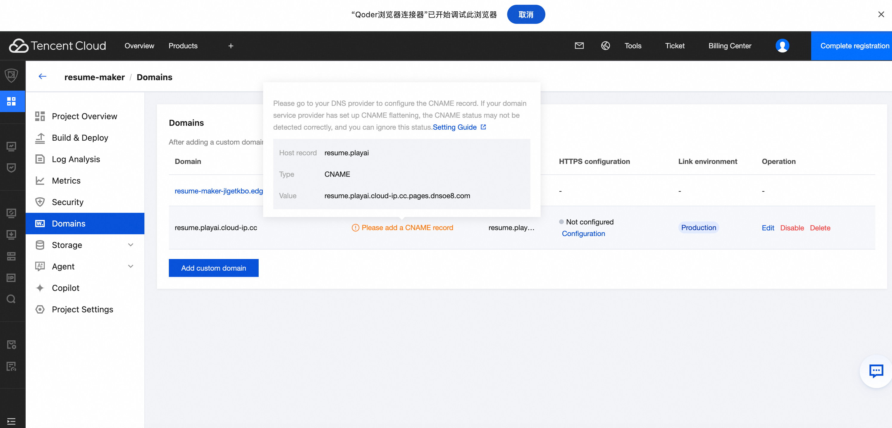
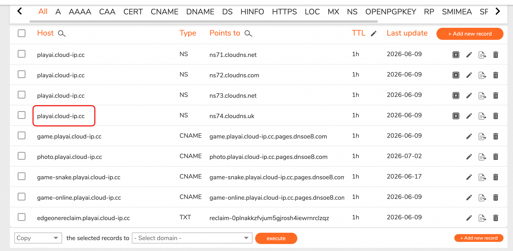
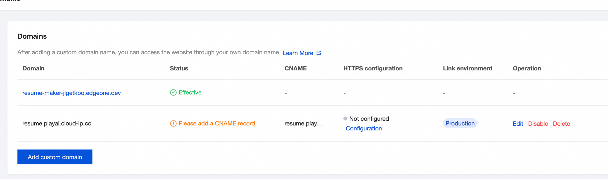
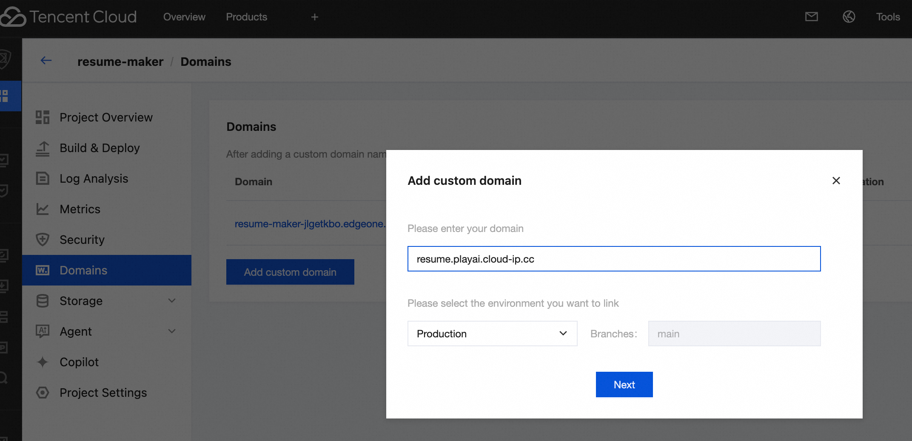

# EdgeOne Pages 部署指南

## 前提条件

- GitHub 仓库已创建并推送代码
- 主域名（如 `playai.cloud-ip.cc`）已在 ClouDNS 配置完成
- 腾讯云 EdgeOne Pages 账号已注册

---

## 一、创建项目并部署

1. 登录 [EdgeOne Pages 控制台](https://console.tencentcloud.com/edgeone/makers)
2. 新建项目 → 从 GitHub 导入仓库（如 `turbobo/resume-maker`）
3. 配置构建参数：

| 配置项 | 值 |
|-------|-----|
| 框架 | Vite |
| 构建命令 | `npm install && npm run build` |
| 输出目录 | `dist` |
| Node 版本 | 18 或 20 |

4. 点击部署，等待构建完成
5. 部署成功后获得默认域名：`resume-maker-xxx.edgeone.dev`

---

## 二、添加自定义子域名

### 第一步：EdgeOne 添加子域名

进入 EdgeOne Pages 项目 → 左侧菜单 **Domains** → 点击 **Add custom domain**

在弹窗中输入子域名（如 `resume.playai.cloud-ip.cc`），选择 **Production** 环境 + **main** 分支，点击 Next。

### 第二步：获取 CNAME 记录

添加后状态显示 **Please add a CNAME record**，点击 CNAME 列的值或点击 **Configuration** 查看详细信息：

| 字段 | 值 |
|------|-----|
| Host record | `resume.playai` |
| Type | `CNAME` |
| Value | `resume.playai.cloud-ip.cc.pages.dnssoe8.com` |

### 第三步：ClouDNS 添加 CNAME 记录

登录 ClouDNS 管理面板，进入 `playai.cloud-ip.cc` 域名，点击 **+ Add new record**：

| 类型 | 主机记录 | 记录值 | TTL |
|------|---------|--------|-----|
| CNAME | resume | `resume.playai.cloud-ip.cc.pages.dnssoe8.com` | 1h |

### 第四步：验证生效

DNS 生效后（1-5 分钟），回到 EdgeOne Domains 页面，状态从 **Please add a CNAME record** 变为 **Effective**，HTTPS 证书自动签发。
若没有生效，可点击Edit按钮，触发一次重新验证

访问 `https://resume.playai.cloud-ip.cc` 即可。

---

## 三、注意事项

- **关闭自动构建**：免费额度 500 次/月，在项目设置中关闭自动部署，手动触发
- **Cloudflare 用户**：CNAME 记录需关闭橙色云朵（设为 DNS only），否则 SSL 证书冲突
- **域名验证失败**：检查 CNAME 值是否复制完整，TTL 是否已过期
- **CNAME Flattening**：如果域名服务商开启了 CNAME 扁平化，EdgeOne 可能检测不到 CNAME 状态，可忽略该提示

---

## 四、项目技术栈

| 项目 | 技术栈 |
|------|-------|
| 前端框架 | Vite + React + TypeScript |
| 样式 | Tailwind CSS v4 |
| 状态管理 | Zustand |
| Word 导入 | mammoth.js |
| Word 导出 | docx |
| PDF 导出 | html2canvas + jsPDF |
| 字体加载 | Google Fonts (动态) |
