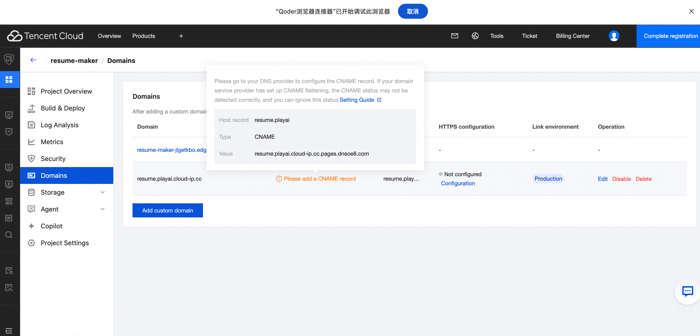
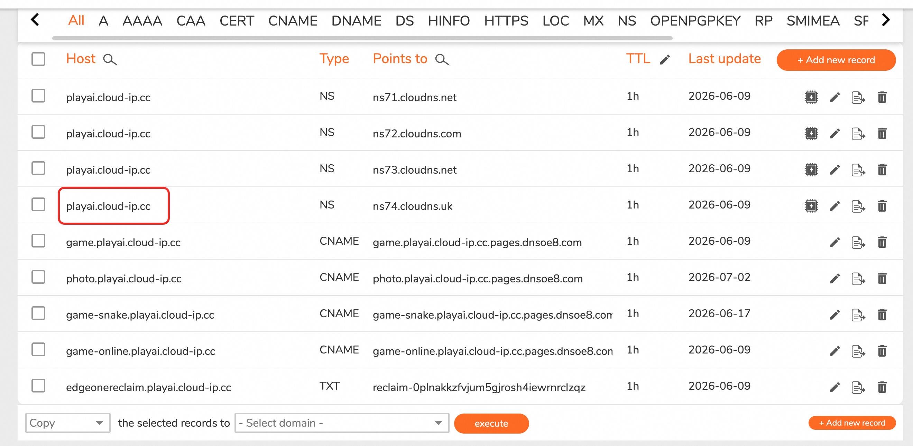
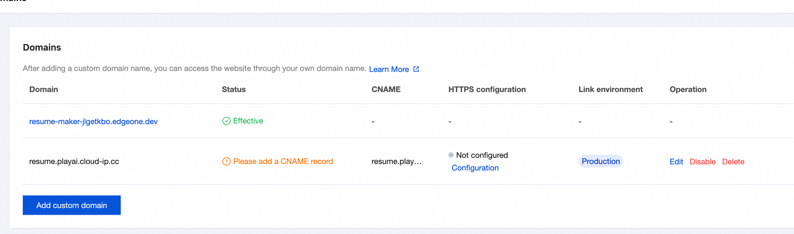
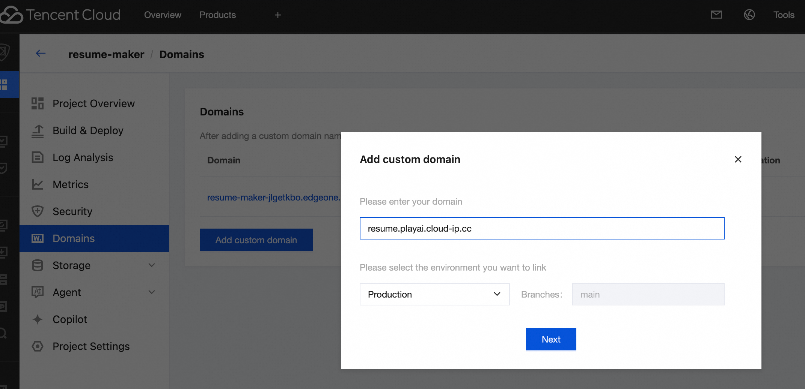

# EdgeOne Pages 部署指南

## 前提条件

- GitHub 仓库已创建并推送代码
- 主域名（如 `playai.cloud-ip.cc`）已在 ClouDNS 配置完成
- 腾讯云 EdgeOne Pages 账号已注册

---

## 一、创建项目并部署

1. 登录 [EdgeOne Pages 控制台](https://console.tencentcloud.com/edgeone/makers)
2. 新建项目 → 从 GitHub 导入仓库（如 `turbobo/resume-maker`）
3. 配置构建参数：

| 配置项 | 值 |
|-------|-----|
| 框架 | Vite |
| 构建命令 | `npm install && npm run build` |
| 输出目录 | `dist` |
| Node 版本 | 18 或 20 |

4. 点击部署，等待构建完成
5. 部署成功后获得默认域名：`resume-maker-xxx.edgeone.dev`

---

## 二、添加自定义子域名

### 第一步：EdgeOne 添加子域名

进入 EdgeOne Pages 项目 → 左侧菜单 **Domains** → 点击 **Add custom domain**

在弹窗中输入子域名（如 `resume.playai.cloud-ip.cc`），选择 **Production** 环境 + **main** 分支，点击 Next。



### 第二步：获取 CNAME 记录

添加后状态显示 **Please add a CNAME record**，点击 CNAME 列的值或点击 **Configuration** 查看详细信息：

| 字段 | 值 |
|------|-----|
| Host record | `resume.playai` |
| Type | `CNAME` |
| Value | `resume.playai.cloud-ip.cc.pages.dnssoe8.com` |



### 第三步：ClouDNS 添加 CNAME 记录

登录 ClouDNS 管理面板，进入 `playai.cloud-ip.cc` 域名，点击 **+ Add new record**：

| 类型 | 主机记录 | 记录值 | TTL |
|------|---------|--------|-----|
| CNAME | resume | `resume.playai.cloud-ip.cc.pages.dnssoe8.com` | 1h |



### 第四步：验证生效

DNS 生效后（1-5 分钟），回到 EdgeOne Domains 页面，状态从 **Please add a CNAME record** 变为 **Effective**，HTTPS 证书自动签发。
若没有生效，可点击Edit按钮，触发一次重新验证

访问 `https://resume.playai.cloud-ip.cc` 即可。



---

## 三、注意事项

- **关闭自动构建**：免费额度 500 次/月，在项目设置中关闭自动部署，手动触发
- **Cloudflare 用户**：CNAME 记录需关闭橙色云朵（设为 DNS only），否则 SSL 证书冲突
- **域名验证失败**：检查 CNAME 值是否复制完整，TTL 是否已过期
- **CNAME Flattening**：如果域名服务商开启了 CNAME 扁平化，EdgeOne 可能检测不到 CNAME 状态，可忽略该提示

---

## 四、配置 AI 能力（商汤 API Key）

AI 接口由项目 `node-functions/` 目录下的 EdgeOne Node Functions 提供，Key 保存在平台环境变量中，不会下发到浏览器。

### 第一步：获取商汤 API Key

登录 [商汤日日新控制台](https://platform.sensenova.cn/console) → 管理中心 → API-Key 管理 → 创建 API-Key（仅创建时完整显示一次，请及时保存）。

### 第二步：配置 API Key（二选一）

**方式一：控制台环境变量（推荐）**

EdgeOne Pages 项目 → 左侧菜单 **Settings / 项目设置** → **Environment variables**，添加：

| 变量名 | 必填 | 说明 |
|--------|------|------|
| `SENSENOVA_API_KEY` | 是 | 商汤 API Key |
| `SENSENOVA_BASE_URL` | 否 | 默认 `https://token.sensenova.cn/v1`，可按需覆盖 |
| `SENSENOVA_MODEL` | 否 | 默认 `deepseek-v4-flash`（免费档 150 次/5 小时） |
| `AI_RATE_WINDOW_MAX` | 否 | 单 IP 10 分钟上限，默认 8 |
| `AI_RATE_DAILY_MAX` | 否 | 单 IP 每日上限，默认 50 |
| `AI_RATE_GLOBAL_DAILY_MAX` | 否 | 全站每日上限，默认 600（按上游 deepseek-v4-flash 免费配额设定） |

配置后重新部署一次使环境变量生效。未配置 `SENSENOVA_API_KEY` 时，前端点击「开始分析」会提示「AI 服务不可用」。

**方式二：代码内置 Key（需先转私有仓库）**

把 Key 填入 `node-functions/api/ai/_shared/sensenova.js` 的 `BUILTIN_API_KEY` 常量（环境变量存在时仍以环境变量为准）：

```js
const BUILTIN_API_KEY = 'sk-你的商汤Key'
```

> ⚠️ **重要安全警告**：本仓库（github.com/turbobo/resume-maker）当前为**公开仓库**。填入真实 Key 并推送后，Key 会立即对全网可见，存在被自动扫描机器人盗用额度的风险。
> 如确需内置，请先在 GitHub 仓库设置中把可见性改为 **Private**，再填写并推送。
> 已推送过真实 Key 的，请立即到商汤控制台吊销并重建 Key。
> 切勿把 Key 写入 `src/` 前端目录（前端代码会下发到浏览器，任何人可在 DevTools 中看到）。

### 第三步：确认部署包含函数

推送到 GitHub 后，在控制台手动触发部署即可。`edgeone.json` 已声明构建参数与函数最大运行时长（60 秒，AI 调用需要）；`node-functions/` 目录会自动构建为 `/api/ai/*` 接口。

接口自检：浏览器访问 `https://你的域名/api/ai/analyze` 应返回 405/400 的 JSON（说明函数已生效）；若返回 404 则检查部署产物是否包含函数。

### 本地联调（可选）

```bash
git clone 仓库 && cd resume-maker
npm install
npm run dev                              # 终端 1：前端（5173 端口）
npx edgeone pages login                  # 终端 2：登录 EdgeOne
npx edgeone pages link                   # 关联线上项目（同步环境变量，可选）
npx edgeone pages dev --fePort=5173      # 启动函数后台联调
```

单元测试：`npm test`（限流器、接口校验、错误映射等 15 个用例，无需网络）。

---

## 五、项目技术栈

| 项目 | 技术栈 |
|------|-------|
| 前端框架 | Vite + React + TypeScript |
| 样式 | Tailwind CSS v4 |
| 状态管理 | Zustand |
| Word 导入 | mammoth.js |
| Word 导出 | docx |
| PDF 导出 | html2canvas + jsPDF |
| 字体加载 | Google Fonts (动态) |
| 服务端函数 | EdgeOne Node Functions（AI 代理 + IP 限流，可选） |
